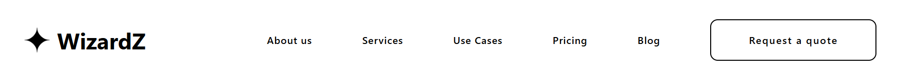
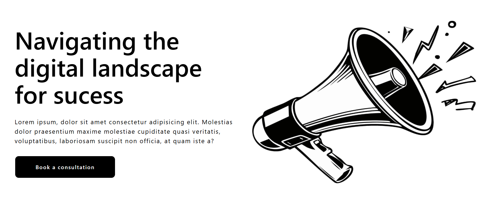
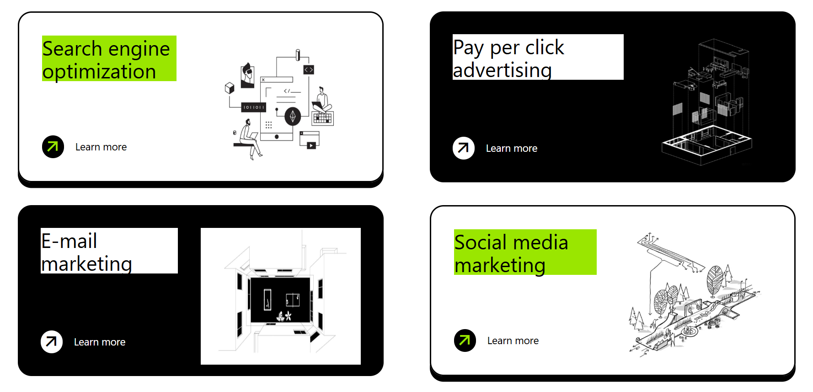
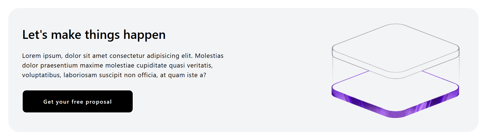
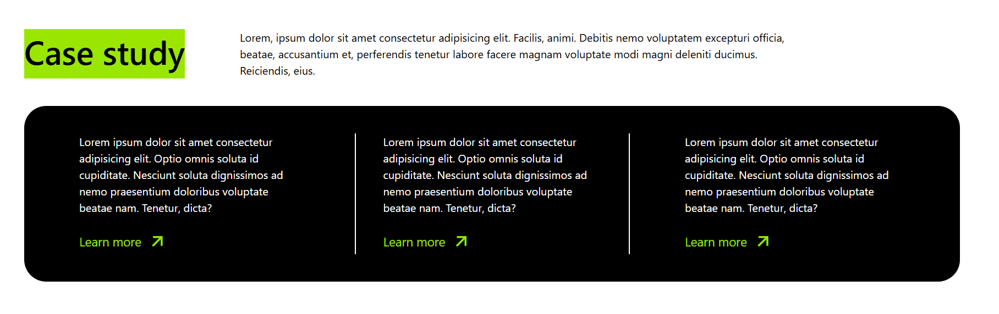

# WizardZ - UI/UX Website

A modern and responsive UI/UX marketing website built using **React.js** and **Tailwind CSS**.

## Preview

This project includes:

- Modern landing page
- Responsive navbar
- Service cards section
- Case study section
- CTA (Call To Action) sections
- Clean UI/UX design
- Component-based React structure

---

## Tech Stack

- React.js
- Tailwind CSS
- JavaScript
- HTML5
- CSS3
- Vite

---

## Features

- Fully responsive layout
- Reusable React components
- Modern UI/UX design
- Clean typography and spacing
- Interactive buttons and sections
- Fast development using Vite

---

## Folder Structure

```bash
src/
│
├── components/
│   ├── sec-1/
│   ├── sec-2/
│   ├── sec-3/
│   ├── sec-4/
│   ├── sec-5/
│   └── sec-6/
│
├── App.jsx
└── main.jsx
```

---

## Screenshots












---

## Installation

Clone the repository:

```bash
git clone https://github.com/your-username/ui-ux-using-react.git
```

Move into the project folder:

```bash
cd ui-ux-using-react
```

Install dependencies:

```bash
npm install
```

Run the development server:

```bash
npm run dev
```

---

## Build for Production

```bash
npm run build
```

---

## Learning Outcome

This project helped me practice:

- React component structure
- Tailwind CSS styling
- Responsive web design
- UI/UX implementation
- Layout designing
- Reusable components

---

## Future Improvements

- Add animations using Framer Motion
- Add dark mode
- Connect backend functionality
- Add contact form integration
- Improve accessibility

---

## Author

Anshu

GitHub: https://github.com/anshu-Creates
